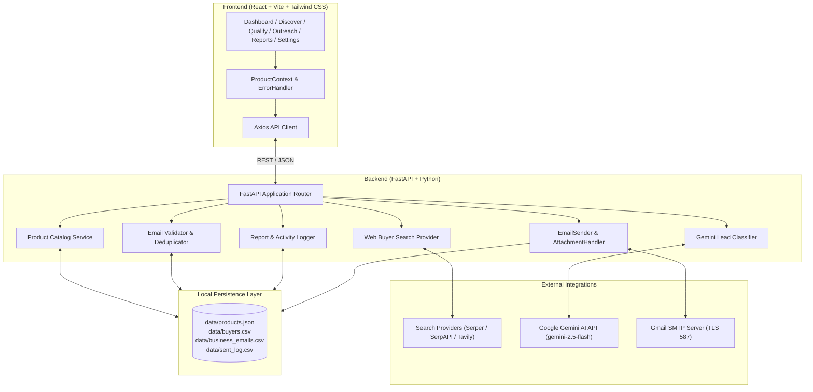

# 🚀 Export Automation System

> AI-powered B2B buyer discovery, qualification, and personalized export outreach platform.

Discover potential international buyers, qualify them with AI, personalize outreach, and track campaign performance from one workflow.

[](https://react.dev/)
[](https://vitejs.dev/)
[](https://tailwindcss.com/)
[](https://fastapi.tiangolo.com/)
[](https://www.python.org/)
[](https://ai.google.dev/)
[](https://serper.dev/)
[](https://workspace.google.com/)
[](https://docs.pytest.org/)

**GitHub Repository:** [https://github.com/naina766/export-automation-system](https://github.com/naina766/export-automation-system)  
**Live Demo:** Coming Soon

---

## 📌 Overview

The **Export Automation System** is a business-to-business (B2B) export sales acceleration platform designed for manufacturers, exporters, and international trade teams. It automates the end-to-end sales prospecting funnel: discovering commercial buyers in target global markets, extracting public business contact information, qualifying fit with generative AI, drafting personalized multi-product email campaigns, and executing outreach safely through authenticated Gmail SMTP.

Traditional export prospecting relies on manual Google searches, trade directory spreadsheets, and copy-paste email templates. This platform unifies these fragmented operations into a cohesive SaaS workflow. Users select an active product line, specify target countries and commercial buyer types, and discover prospective importers in real time.

Buyer discovery is API-first, querying configured search providers directly so teams never need to prepare a spreadsheet before getting started. For organizations with established contact archives, the platform also provides an optional CSV import mechanism to ingest and deduplicate existing partner records.

By pairing live web intelligence with Google Gemini qualification and resilient email dispatch guardrails, the platform reduces prospecting cycles from hours to minutes while preventing generic, low-relevance outreach.

---

## 🎯 Problem

Export sales teams and international trade representatives face substantial friction in expanding to global markets:

1. **Slow Manual Prospecting:** Locating relevant international buyers across multiple countries and languages requires hours of manual directory searching and browsing company websites.
2. **Category Ambiguity:** Export teams need commercial wholesale importers, distributors, and specialty retailers—not individual retail shoppers, consumer blogs, or unrelated directory listings.
3. **Lack of Qualification:** Raw search results lack business context. Sales reps must manually inspect each prospect to determine whether their inventory profile aligns with the exporter's product line.
4. **Low-Conversion Generic Messaging:** Bulk blast emails that do not address the buyer's organization, country, or specific product fit suffer from poor engagement and high spam rates.
5. **Incomplete Contact Records:** Public business listings frequently feature missing, malformed, or general inquiries emails, requiring systematic validation before outreach.
6. **Outreach Collision & Duplicate Sends:** Without centralized deduplication, multiple team members risk contacting the same buyer, harming company reputation and sender domain authority.
7. **Multi-Product Complexity:** Export manufacturers frequently sell distinct product tiers with different target markets, keywords, and brochures, making manual tracking error-prone.

---

## 💡 Solution

The Export Automation System resolves these pain points through a structured, multi-product pipeline:

```text
Select Product Line
        ↓
Define Target Market (Country & Buyer Category)
        ↓
Discover Buyers (Live Web Search API)
        ↓
Validate Contact Information & Syntax
        ↓
AI Qualification & Commercial Fit Scoring (Gemini)
        ↓
Personalized Outreach Template Construction
        ↓
User Review & Confirmation Guardrails
        ↓
Email Campaign Dispatch (Gmail SMTP + PDF Catalog)
        ↓
Campaign Tracking, Audit Logs & Analytics
```

- **Product Selection:** Select an active export line from the product catalog (e.g. *Himalayan Sound Healing Bowls* or *Crystal Singing Bowls*). Keywords, target countries, and brochure assets dynamically update across the entire app.
- **Market Targeting:** Filter searches by country and commercial category (e.g. *Wholesale Importer*, *Distributor*, *Wellness Center*).
- **Live Discovery:** Real-time web search APIs retrieve active business websites and public contact information without fabricating data.
- **Validation:** Syntax and domain hygiene checks exclude malformed emails and suppress duplicates against historical dispatch logs.
- **AI Qualification:** Google Gemini analyzes company profiles, evaluates commercial fit, assigns a score (0–100), and categorizes prospects into business versus individual leads.
- **Personalized Outreach:** Dynamic variables (`{{product_name}}`, `{{company_name}}`, `{{contact_name}}`, `{{country}}`) generate customized introductory proposals with an optional attached PDF presentation.
- **Human in the Loop:** A modal confirmation step displays recipient counts, template previews, and safety checks prior to dispatch.
- **Delivery & Reporting:** Outgoing emails are sent via authenticated Gmail SMTP with automatic retry logic, logged to an activity audit trail, and visualized in real-time reporting dashboards.

---

## ✨ Key Features

### 🌍 Live Buyer Discovery
- **Real-Time Web Intelligence:** Queries live search APIs using product-aware keyword formulations rather than static databases.
- **Market & Persona Filters:** Narrow prospect discovery by geographic territory and buyer classification (e.g., *Distributor*, *Wholesale Importer*, *Sound Bath Studio*).
- **Contact Normalization:** Automatically extracts business names, clean domain URLs, and verified contact points. Missing contact details remain marked as unavailable rather than fabricated.
- **Supported Integrations:** Built with a modular provider abstraction supporting **Serper** (default & recommended), **SerpAPI**, **Tavily**, and **Google Custom Search** where configured.

### 📦 Multi-Product Catalog
- **Multi-Line Support:** Manage distinct export catalog items within `data/products.json`, including:
  - *Himalayan Sound Healing Bowls*
  - *Tibetan Singing Bowls*
  - *Crystal Singing Bowls*
  - *Meditation Bowls*
  - *Handcrafted Brass Singing Bowls*
- **Dynamic Context Switching:** Switching the active product dynamically updates discovery search keywords, target country defaults, AI qualification criteria, email template subject/body copies, and attached PDF brochures.
- **Responsive Management:** Add, edit, remove, and activate export product lines directly from the Settings interface.

### 🤖 AI Buyer Qualification
- **Intelligent Fit Analysis:** Uses Google Gemini (`gemini-2.5-flash`) to assess prospective buyers against active product specifications.
- **Structured Scoring:** Assigns an objective commercial fit score (0–100), categorization (*distributor*, *wholesaler*, *retailer*, *individual*), and priority tier (*High Priority*, *Medium Priority*, *Low Priority*).
- **Reasoning Snippets:** Generates concise 1-sentence explanations detailing why a specific buyer is relevant to the exporter's product line.
- **Partitioned Pipeline:** Segregates qualified B2B commercial entities from individual or non-commercial inquiries to maintain high outreach conversion.

### 📧 Personalized Outreach
- **Dynamic Variable Interpolation:** Automatically populates email subjects and bodies with contextual variables:
  - `{{product_name}}` — Active export product title
  - `{{company_name}}` — Prospect's company or organization
  - `{{contact_name}}` — Lead procurement or contact representative
  - `{{country}}` — Recipient's target country or market
  - `{{buyer_type}}` — Commercial buyer categorization
- **Template Helper:** Alerts users when product variables are present and provides direct navigation to product catalog settings.
- **PDF Catalog Attachment:** Automatically attaches official product presentation decks (`company_presentation.pdf`) to outgoing introductory emails.

### 🔒 Validation & Deduplication
- **Data Hygiene:** Evaluates email addresses for RFC syntax conformity, domain formatting, and reserved placeholder patterns (`example.com`, `.test`).
- **Deterministic Buyer Identifiers:** Generates deterministic hashes based on company name, website domain, and email address.
- **Cross-Campaign Suppression:** Checks new leads against `sent_log.csv` and existing contact tables to prevent contacting the same organization twice.
- **Inline Enrichment:** Allows users to re-attempt contact extraction on public websites or manually edit contact details with inline format verification.

### 📨 Gmail Outreach
- **Authenticated SMTP Delivery:** Dispatches outreach via Google's standard secure mail transport (Port 587, STARTTLS) using standard Google App Passwords.
- **Single Test Dispatch:** Send an individual test proposal to any email address to review rendering and formatting before launching batch campaigns.
- **Safety Confirmation Modal:** Displays a summary of the target audience, recipient count, subject line, and brochure status, requiring explicit user approval before execution.
- **Rate & Error Safeguards:** Implements configurable send delays (e.g. 1–2 seconds per message) and retry loops for transient SMTP timeouts.

### 📊 Campaign Analytics
- **Conversion Tracking:** Real-time KPI summary tracking total discovered prospects, validated contacts, qualified business buyers, emails sent, and delivery success rate.
- **Geographic & Category Insights:** Visual market coverage breakdown showing prospect density across target countries.
- **Activity Audit Trail:** Searchable, timestamped delivery log tracking recipient details, delivery status, and notes.
- **Instant Filtering & Caching:** Instant visual feedback when filtering by date range (*All Time*, *Last 30 Days*, *Last 7 Days*, *Today*), product, or country with debounced state caching.
- **One-Click Export:** Download comprehensive CSV reports summarizing campaign metrics and recipient logs.

---

## 🖥️ Product Screenshots

<!-- Add screenshot: Dashboard Overview -->
<!-- Add screenshot: Live Buyer Discovery -->
<!-- Add screenshot: Buyer Qualification & AI Scoring -->
<!-- Add screenshot: Launch Outreach & Personalization -->
<!-- Add screenshot: Campaign Analytics & Reports -->
<!-- Add screenshot: Multi-Product Catalog Settings -->

---

## 🏗️ Architecture

The system follows a decoupled client-server architecture with modular domain services:



---

## 🔄 End-to-End Workflow

1. **Step 1 — Product Selection:** The user selects or activates an export product from the top navigation dropdown or settings catalog.
2. **Step 2 — Buyer Discovery:** The user chooses a destination country and buyer type on `/discover`. The backend constructs a targeted search query and fetches live search results via Serper/configured provider.
3. **Step 3 — Buyer Normalization:** Search result payloads are parsed, extracting company names, website URLs, snippet context, and publicly available email addresses.
4. **Step 4 — Contact Validation:** The validation engine checks email syntax and suppresses previously contacted companies or duplicates. Missing emails are clearly marked as unavailable.
5. **Step 5 — AI Qualification:** On `/classify`, Google Gemini processes discovered leads in batches, scoring export alignment and partitioning records into business versus individual categories.
6. **Step 6 — Outreach Personalization:** The user navigates to `/campaign`. The active product's email templates are loaded, and dynamic variables (`{{product_name}}`, `{{company_name}}`, etc.) are interpolated into live preview panes.
7. **Step 7 — Review & Confirmation:** The user inspects the preview, verifies that the PDF brochure is attached, and clicks Launch Outreach. A modal confirms audience details and safeguards.
8. **Step 8 — Email Delivery:** The backend connects to `smtp.gmail.com:587`, initiates STARTTLS encryption, logs in via App Password, and dispatches messages with configured delays.
9. **Step 9 — Activity Logging:** Every send attempt (success or failure) is appended to `data/sent_log.csv` with recipient details, timestamps, and error codes.
10. **Step 10 — Reporting & Analytics:** The `/reports` dashboard immediately reflects updated delivery statistics, audience breakdown, and country distributions with instant filtering and CSV export.

---

## 🛠️ Tech Stack

### Frontend
- **React 18.2** — Component-driven user interface
- **Vite 5.1** — Fast frontend tooling and bundling
- **Tailwind CSS 3.4** — Modern utility-first styling and dark SaaS aesthetic
- **React Router 6.22** — Single-page application client routing
- **Axios 1.6** — HTTP client with centralized error interception and sanitization
- **Lucide React 0.363** — Clean, modern iconography
- **React Context API** — Global multi-product state synchronization

### Backend
- **Python 3.10+** — Core backend runtime
- **FastAPI 0.110** — High-performance asynchronous REST API framework
- **Uvicorn 0.28** — Production ASGI web server
- **Pydantic 2.6** — Strict request/response schema validation and type safety
- **Pandas 2.2** — Tabular data manipulation and CSV persistence
- **HTTPX 0.27** & **Requests 2.31** — Asynchronous and synchronous HTTP integrations
- **BeautifulSoup4 4.12** — Lightweight HTML contact metadata parsing

### AI & Integrations
- **Google Gemini API** (`google-generativeai` / `google-genai`) — AI lead classification (`gemini-2.5-flash`)
- **Serper.dev** — Commercial search engine API for live buyer discovery
- **SerpAPI / Tavily / Google Custom Search** — Optional discovery search providers
- **Gmail SMTP (`smtplib` + `email`)** — Secure email delivery via Port 587 with STARTTLS

### Testing & Quality
- **Pytest 8.0+** — Comprehensive unit and integration test suite (41 automated tests)
- **Vite Build** — Production minification and bundle validation

---

## 💾 Data Storage

The current project implementation uses structured **local file-based persistence** located in the `data/` directory:

- `data/products.json` — Product catalog definitions, search keywords, target countries, buyer categories, and email templates.
- `data/buyers.csv` — Discovered leads, website domains, contact names, extracted emails, and verification statuses.
- `data/business_emails.csv` — Qualified commercial B2B buyer records produced by Gemini classification.
- `data/individual_emails.csv` — Individual or consumer-tier contacts excluded from bulk B2B outreach.
- `data/sent_log.csv` — Historical audit log of every email dispatch attempt, delivery outcome, and timestamp.

> **Architecture Note:** Local file-based persistence is intentionally used for simplicity in this project implementation. It provides transparent data inspection and rapid local evaluation, and can be replaced with a managed relational database (such as PostgreSQL) and Redis task queues as the platform scales to multi-tenant environments.

---

## 🔐 Security & Data Protection

- **Server-Side Credential Storage:** All API keys (Gemini, Serper) and email credentials (Gmail App Password) are loaded on the backend via environment variables (`.env`). Secrets are never exposed to the frontend or browser bundle.
- **Application Passwords:** Gmail delivery uses dedicated 16-character Google App Passwords rather than personal Google account passwords.
- **Sanitized Error Handling:** Client-facing responses and UI banners display sanitized, business-friendly messages, preventing the leakage of internal stack traces, database paths, or provider keys.
- **No Fabricated Data:** The discovery engine explicitly marks missing contact points as unavailable rather than generating fictional email addresses.
- **Demo Outreach Blocker:** Sample workflow demonstration records are marked with `is_demo=True`. The backend explicitly rejects any attempt to send live outreach to demo records (`HTTP 422 DEMO_DATA_OUTREACH_BLOCKED`).
- **Deterministic Deduplication:** Prevents duplicate outreach to the same recipient across separate prospecting runs.

---

## 🧪 Demo / Sample Workflow

To allow immediate evaluation of the qualification, template review, and reporting pipeline when search credentials are not yet configured:

- **Explicitly User-Triggered:** Clicking `[ Explore Sample Workflow ]` on the Discover Buyers page loads realistic demonstration buyer records.
- **Safety Separation:** Sample records are labeled with a prominent **`DEMO DATA`** warning banner and card badges.
- **Zero Production Contamination:** Demonstration records cannot be sent live outreach and are excluded from production campaign performance reports.

---

## 📁 Project Structure

```text
export-automation-system/
│
├── backend/
│   ├── classification/         # Gemini AI classification & scoring
│   ├── extraction/             # Lead metadata extraction
│   ├── logging_module/         # Activity logging & audit trails
│   ├── outreach/               # Gmail SMTP delivery & PDF attachment handling
│   ├── products/               # ProductCatalog manager (multi-product)
│   ├── reports/                # Campaign metrics generator & CSV exports
│   ├── search/                 # Search providers (Serper, SerpAPI, Tavily, CSE)
│   ├── validation/             # Email format validation & duplicate checks
│   ├── config.py               # Centralized configuration & environment loader
│   └── main.py                 # FastAPI application routes & endpoints
│
├── frontend/
│   ├── public/                 # Static web assets
│   └── src/
│       ├── components/         # Layout, Navbar, StatusBadges, Notification, Modals
│       ├── context/            # ProductContext (active product state management)
│       ├── pages/              # Dashboard, Discover, Import, Qualify, Outreach, Reports, Settings
│       ├── services/           # Axios API client & centralized error handler
│       ├── App.jsx             # Route definitions
│       └── main.jsx            # React root application bootstrap
│
├── assets/                     # Company presentation PDF brochure
├── data/                       # Local file persistence (products, leads, logs)
├── tests/                      # Automated test suite (Pytest)
├── .env.example                # Sample environment configuration
├── pytest.ini                  # Pytest configuration
├── requirements.txt            # Python backend dependencies
└── README.md                   # Project documentation
```

---

## 🚀 Getting Started

### Prerequisites
- **Python 3.10+**
- **Node.js 18+** & **npm**
- A **Google Gemini API Key** ([Google AI Studio](https://aistudio.google.com/))
- A **Serper.dev Search API Key** ([Serper.dev](https://serper.dev/))
- A **Gmail Account** with 2-Step Verification & [App Password](https://myaccount.google.com/apppasswords)

---

### Installation

#### 1. Clone the Repository
```bash
git clone https://github.com/naina766/export-automation-system.git
cd export-automation-system
```

#### 2. Backend Setup
Create and activate a virtual environment:

**Windows (PowerShell):**
```powershell
python -m venv venv
.\venv\Scripts\Activate.ps1
```

**Linux / macOS:**
```bash
python3 -m venv venv
source venv/bin/activate
```

Install backend dependencies:
```bash
pip install -r requirements.txt
```

#### 3. Frontend Setup
In a separate terminal window:
```bash
cd frontend
npm install
```

---

### Configuration

Create a `.env` file in the root directory by copying `.env.example`:

```bash
cp .env.example .env
```

Open `.env` and fill in your credentials:

```env
# 1. LIVE BUYER DISCOVERY (SERPER RECOMMENDED)
SEARCH_PROVIDER=serper
SEARCH_API_KEY=your_serper_api_key_here

# 2. GOOGLE GEMINI AI LEAD QUALIFICATION
GEMINI_API_KEY=your_gemini_api_key_here
GEMINI_MODEL=gemini-2.5-flash

# 3. GMAIL SMTP SECURE OUTREACH TRANSPORT
GMAIL_EMAIL=your_export_sales_email@gmail.com
GMAIL_APP_PASSWORD=your_16_characteruvicorn main:app --reload --port 8000_app_password

SMTP_HOST=smtp.gmail.com
SMTP_PORT=587

# 4. BUSINESS PARAMETERS & RUNTIME SAFEGUARDS
SEARCH_KEYWORD=Himalayan Sound Healing Bowls
SEND_DELAY=1
MAX_EMAILS_PER_RUN=25
DAILY_SEND_LIMIT=100
```

> **Security Reminder:** Never commit `.env` or credential files to GitHub. The `.gitignore` file is preconfigured to protect `.env`.

---

### Running the Application

1. **Start the FastAPI Backend:**
   ```bash
   
   ```
   *The API will be available at `http://localhost:8000`. Interactive API docs are accessible at `http://localhost:8000/docs`.*

2. **Start the Vite Frontend:**
   ```bash
   cd frontend
   npm run dev
   ```
   *The web application will open at `http://localhost:5173`.*

---

## 🧪 Testing

The platform includes an automated test suite covering search query construction, email validation, deduplication, Gemini classification, multi-product catalog operations, report metrics, and security boundaries.

Run the test suite:
```bash
pytest tests/ -v
```

**Test Verification Status:**
```text
collected 41 items
tests/test_api.py .................
tests/test_classification.py ..
tests/test_products.py ...
tests/test_reports.py ...
tests/test_search_discovery.py ..............
tests/test_validation.py ..
============================== 41 passed in 2.82s ==============================
```

Verify frontend build integrity:
```bash
cd frontend
npm run build
```

---

## 🎨 UX & Product Design

- **Professional B2B SaaS Aesthetics:** Polished dark-mode color palette (`#050816`, `#0B1220`, `#1E293B`) with purple (`#7C3AED`) and cyan (`#06B6D4`) accents.
- **Workflow State Clarity:** Explicit empty states for unconfigured services (State A), temporary connection issues (State B), and zero results (State C).
- **Smooth Feedback:** Micro-animations, responsive tag wrapping (`gap-2`, `px-2.5 py-1`), skeleton loading for reports, and active product transitions.
- **Business-First Language:** Clean, commercial terminology throughout the platform without exposing technical jargon (such as HTTP status codes, stack traces, or internal database IDs).

---

## 🧠 Engineering Highlights

- **Modular Search Provider Abstraction:** `WebBuyerSearchProvider` defines a standardized interface implemented by Serper, SerpAPI, Tavily, and Google CSE. Search providers can be swapped via environment variables without touching pipeline code.
- **Context-Aware Product Architecture:** Product state is maintained globally via React Context and synced with `ProductCatalog`. Selecting a product automatically re-indexes discovery keywords, AI qualification prompts, template subject/body copies, and brochure attachments.
- **Defensive Contact Extraction:** Contacts extracted from public websites are strictly verified against RFC syntax specifications. Missing emails remain marked as `missing` rather than generating placeholder contacts.
- **Self-Healing Model Fallbacks:** The Gemini classification layer and settings connection test automatically detect deprecated model names and seamlessly upgrade to supported models (`gemini-2.5-flash`), ensuring high operational reliability.
- **Deterministic Deduplication:** Leads are hashed on composite keys to enforce idempotency and prevent duplicate outreach across separate campaign runs.

---

## ⚠️ Current Limitations

- **File-Based Storage:** Local CSV/JSON storage is suitable for single-operator use cases; a relational database (e.g. PostgreSQL) is recommended for concurrent multi-user environments.
- **Public Directory Limitations:** Discovery depends on public business listings indexed by search engines. Organizations without clear public web pages or contact points cannot be reached automatically.
- **Mailbox Deliverability Verification:** Syntax validation confirms RFC formatting but does not verify real-time mailbox bounce status (SMTP handshake pinging).
- **Search Engine Rate Limits:** Live search throughput is subject to third-party provider quotas and rate limits.

---

## 🗺️ Future Improvements

- [ ] Transition from local CSV storage to PostgreSQL with Alembic migrations
- [ ] Background job queues using Celery or Redis for high-volume async dispatch
- [ ] Real-time email engagement tracking (open tracking, link click tracking)
- [ ] Webhook-based automated unsubscribe handling and suppression list sync
- [ ] Multi-tenant user authentication and team role permissions (RBAC)
- [ ] Inbound email response parsing to detect buyer replies and sentiment
- [ ] CRM integrations (HubSpot, Salesforce, Pipedrive)

---

## 📈 Why This Project Matters

International trade development has historically been dominated by expensive enterprise subscription tools or manual, labor-intensive data entry. The **Export Automation System** demonstrates how modern web engineering, generative AI, and API integrations can converge into an accessible, high-efficiency SaaS tool that automates cold prospecting responsibly.

It showcases the ability to architect, build, test, and polish a full-stack product combining:
- **Full-Stack Engineering:** Robust FastAPI backend + clean, responsive React frontend.
- **AI / LLM Integration:** Structured prompt design, schema extraction, and qualification heuristics.
- **Resilient Automation:** Authenticated SMTP dispatch with retries, safeguards, and comprehensive activity auditing.
- **Product-Minded Thinking:** Designing software that solves real commercial problems with intuitive UX.

---

## 👨‍💻 Skills Demonstrated

- **Full-Stack Application Development** (React 18, Vite, FastAPI, Python 3.10+)
- **API Design & Integration** (RESTful architecture, Pydantic validation, external search APIs)
- **Generative AI Engineering** (Google Gemini integration, structured JSON output formatting, qualification scoring)
- **Data Hygiene & Processing** (Email syntax validation, deduplication, Pandas data transformations)
- **Automated Communication Systems** (Authenticated SMTP, STARTTLS, MIME multi-part attachments)
- **Software Quality Assurance** (Comprehensive Pytest test suites, unit testing, mocked fixtures)
- **Modern Product UX/UI** (Tailwind CSS, dark mode design systems, responsive layouts, clear state handling)

---

## 📬 Responsible Outreach

This platform is intended exclusively for legitimate B2B commercial communications between established businesses. When utilizing email automation:
- Ensure messages comply with applicable international trade and privacy legislation (e.g., CAN-SPAM, GDPR B2B provisions).
- Clearly identify your organization and commercial intentions.
- Honor all unsubscribe and opt-out requests immediately.
- Maintain reasonable sending intervals to respect mail server resource limits.

---

## 👩‍💻 Author

**Naina Varshney**  
B.Tech — Computer Science & Engineering (Data Science)  
Ajay Kumar Garg Engineering College, Ghaziabad  

- **GitHub:** [https://github.com/naina766](https://github.com/naina766)
- **Repository:** [https://github.com/naina766/export-automation-system](https://github.com/naina766/export-automation-system)

---

## 📄 License

License: Not specified
